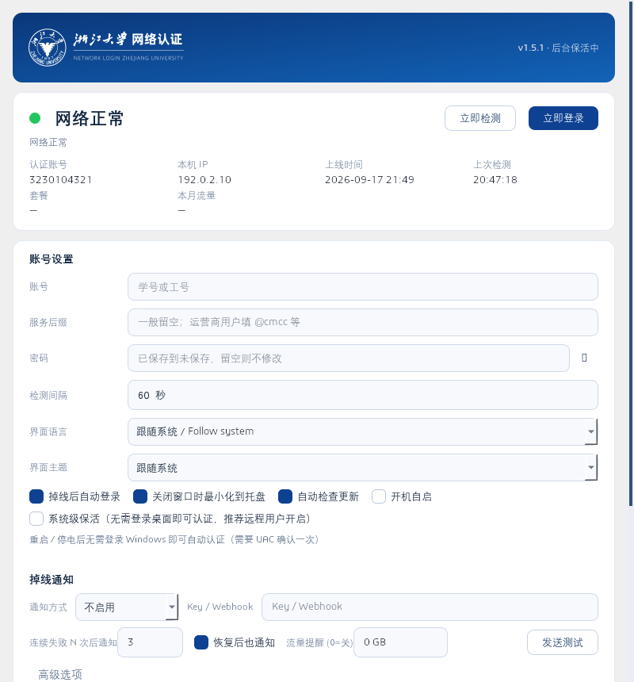

# ZJU-AutoLogin · Zhejiang University Campus Network Auto-Login

**[English](README.en.md) | [简体中文](README.md)**

A tray application that runs in the background: it **watches the Zhejiang University campus network (Srun portal) authentication state and re-authenticates automatically with your saved credentials** whenever it drops or expires — so Remote Desktop / SSH sessions never die because of an expired captive-portal login.

## Why

ZJU's campus network (wired + ZJUWLAN) uses a Srun web portal. Even with MacAuth enabled, the portal **forces a manual re-login every 14 days**, and any IP change / reconnect drops the session too. If that happens while you are away, your remote connection is gone. This tool logs back in for you before you even notice.

## Features

- **First-run wizard** — detects the network automatically; if you are already online it fills in your account name from the portal (the password can never be captured — you type it once)
- **Keep-alive** — configurable interval (default 60 s); auto re-login with exponential backoff (60 s → 10 min); tray notification when a session is restored
- **System-level keep-alive (Windows)** — optional SYSTEM scheduled task that authenticates **before anyone logs into Windows**, so the machine survives reboots and power cuts while you are away
- **Offline push notifications** — Bark / ServerChan / WeCom / DingTalk / SMTP email when login keeps failing; also a recovery notice
- **Heartbeat (dead man's switch)** — ping a healthchecks.io URL every 5 minutes while online; the external service alerts you when the machine goes completely silent
- **Device manager** — when the E2620 device limit is hit, list the account's online devices and kick one (the local device is marked and protected)
- **Traffic panel & monthly alert** — plan name, traffic usage in the tray tooltip, monthly limit alert
- **Scheduled daily re-auth**, **battery-aware polling** (slows down on battery), **dark mode**, **window geometry memory**
- **CLI mode** — `python cli.py check | login | watch` for Task Scheduler / SSH
- **i18n** — 简体中文 / English, follows the system language
- **Diagnostics** — copy-to-clipboard diagnostics, rolling `app.log`, network event timeline

## Protocol (how it works)

The portal at `net.zju.edu.cn` is a Srun system (`ac_id=80`). The implementation in [zju_autologin/srun.py](zju_autologin/srun.py) is reverse-engineered from the portal's own JavaScript:

1. `GET /cgi-bin/get_challenge?username=..&ip=..` → one-time token
2. `hmd5 = HMAC-MD5(token, password)`; `info = "{SRBX1}" + customBase64(XXTEA(json_info, token))`; `chksum = SHA1(token‖username‖token‖hmd5‖...)`
3. `GET /cgi-bin/srun_portal?action=login&...` (custom base64 alphabet: `LVoJPiCN2R8G90yg+hmFHuacZ1OWMnrsSTXkYpUq/3dlbfKwv6xztjI7DeBE45QA`)
4. `GET /cgi-bin/rad_user_info` → online status

## Install

Grab a package from [Releases](https://github.com/Xinzhe99/zju-autologin/releases/latest) (built by GitHub Actions):

| Platform | Installer | Portable |
| --- | --- | --- |
| Windows | `ZJUAutoLogin-*-windows-setup.exe` | `ZJUAutoLogin-*-windows-portable.zip` |
| macOS | `ZJUAutoLogin-*-macos.dmg` | `ZJUAutoLogin-*-macos-portable.zip` |

## Quick start

1. **Install** the setup package (or unzip the portable one and run `ZJUAutoLogin.exe`)
2. **First-run wizard** — it detects your network; if you are already online your account is filled in automatically. Confirm it, enter your campus password once, tick "Launch at startup", done
3. **That's it** — the app lives in the tray and re-authenticates before you even notice a drop

Recommended for remote access: enable **System-level keep-alive** in Settings (authenticates before Windows login), and configure **offline notifications** so your phone knows if anything needs manual attention.

> Running from source (developers): see [CONTRIBUTING.md](CONTRIBUTING.md).

> macOS builds are unsigned — right-click the app → **Open**, or run `xattr -cr /Applications/ZJU\ AutoLogin.app`.

## License

[MIT](LICENSE). The university seal belongs to Zhejiang University and is only used as an identifier.
