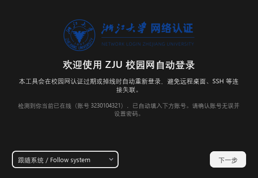

# ZJU-AutoLogin · 浙江大学校园网自动登录

[](https://github.com/Xinzhe99/zju-autologin/actions/workflows/test.yml)
[](https://github.com/Xinzhe99/zju-autologin/releases)
[](https://github.com/Xinzhe99/zju-autologin/releases)
[](https://github.com/Xinzhe99/zju-autologin/stargazers)
[](https://github.com/Xinzhe99/zju-autologin/issues)
[](https://github.com/Xinzhe99/zju-autologin/commits)
[](https://www.python.org/)
[](https://www.riverbankcomputing.com/software/pyqt/)
[](https://github.com/Xinzhe99/zju-autologin/releases)
[](LICENSE)

**简体中文** | [English](README.en.md) | [日本語](README.ja.md) | [한국어](README.ko.md) | [Español](README.es.md) | [Français](README.fr.md) | [Deutsch](README.de.md)

一个挂在系统托盘的后台小程序：**自动检测浙江大学校园网认证状态，掉线/过期后用保存的学号密码自动重新登录**，保证远程桌面、SSH 等连接不会因认证过期而失联。支持 Windows / macOS / Linux。

> 本工具面向浙江大学（net.zju.edu.cn）开发与维护。认证协议基于深澜（Srun）标准实现，**其他使用深澜门户的高校也可能可用**——向导会自动探测你的学校，欢迎反馈与贡献（见[学校兼容性](#学校兼容性)）。

| 主界面 | 首次引导 |
| --- | --- |
|  |  |

## 目录

- [为什么需要它](#为什么需要它)
- [下载安装](#下载安装)
- [快速上手](#快速上手)
- [功能一览](#功能)
- [Linux / 嵌入式设备](#linux--嵌入式设备一行命令启用)
- [学校兼容性](#学校兼容性)
- [校园网认证机制解析](#校园网认证机制解析)
- [进阶用法](#进阶用法)
- [配置与密码存储](#配置与密码存储)
- [常见问题](#常见问题)
- [项目结构](#项目结构)
- [开发说明](#开发说明)
- [支持与贡献](#支持与贡献)

## 为什么需要它

浙大校园网采用深澜（Srun）门户认证，官方规则：

> 为了您的账号安全，**无感知认证周期设定为 14 天**，到期后需重新登录。

即使开了免认证（MacAuth），**每 14 天也得手动登录一次**；IP 变化、重连、重启同样会掉线。人在校外远程连实验室电脑时遇到掉线——**远程失联，只能跑回去**。本工具把重新登录交给后台，远程永不失联。

## 下载安装

到 [Releases](https://github.com/Xinzhe99/zju-autologin/releases/latest) 下载最新版（由 GitHub Actions 自动构建）。

**国内下载慢？** 在下载链接前加代理前缀即可加速（实测 ~1.5 MB/s）：

```
https://gh-proxy.com/https://github.com/Xinzhe99/zju-autologin/releases/download/版本号/文件名
```

或直接复制改好的最新版直链（安装包/便携包文件名带版本号，`latest/download/` 后必须写完整文件名，否则 404）：[Windows 安装包](https://gh-proxy.com/https://github.com/Xinzhe99/zju-autologin/releases/download/v1.25.5/ZJUAutoLogin-1.25.5-windows-setup.exe) · [Windows 便携版](https://gh-proxy.com/https://github.com/Xinzhe99/zju-autologin/releases/download/v1.25.5/ZJUAutoLogin-1.25.5-windows-portable.zip) · [Windows CLI 瘦身包](https://gh-proxy.com/https://github.com/Xinzhe99/zju-autologin/releases/latest/download/zju-autologin-windows-cli.exe) · [macOS dmg](https://gh-proxy.com/https://github.com/Xinzhe99/zju-autologin/releases/download/v1.25.5/ZJUAutoLogin-1.25.5-macos.dmg)

> 代理前缀仅加速下载，不改内容；介意可对照 [官方 Releases](https://github.com/Xinzhe99/zju-autologin/releases/latest) 校验。

| 平台 | 安装版（推荐） | 便携版 |
| --- | --- | --- |
| Windows | `ZJUAutoLogin-*-windows-setup.exe` | `ZJUAutoLogin-*-windows-portable.zip` |
| Windows 仅保活（8MB） | — | `zju-autologin-windows-cli.exe` |
| macOS | `ZJUAutoLogin-*-macos.dmg` | `ZJUAutoLogin-*-macos-portable.zip` |

- Windows 安装包按用户安装（无需管理员权限），可选创建桌面图标与开机自启
- 便携版解压即用，不写注册表
- 已安装的旧版本会在检测到新版本时于界面顶部提示**一键更新**
- macOS 未做代码签名：首次打开若被 Gatekeeper 拦截，请右键 App →"打开"，或到"系统设置 → 隐私与安全性"放行

## 快速上手

1. **安装并打开**——首次自动进入引导向导：已在线则**账号自动带出**，只需输一次密码（仅存本机），勾选"开机自启"，完成
2. **之后全自动**——程序驻留托盘，掉线/14 天到期自动重登，恢复后弹通知

**远程使用推荐配置**（人在校外连实验室电脑）：

| 配置 | 位置 | 作用 |
| --- | --- | --- |
| 系统级保活 | 设置 | 重启/停电后无需登录 Windows 即自动认证 |
| 掉线通知 | 设置 → 掉线通知 | 自动重登失败时（如密码被改）手机收到提醒 |
| 心跳 URL | 设置 → 高级选项 | 机器彻底失联时由外部服务报警 |

托盘图标即状态（绿=在线 / 红=掉线 / 蓝=检测中 / 灰=无校园网），悬停看 IP 与流量，右键有快捷操作。界面支持中/英，跟随系统语言。

## 功能

**核心保活**
- ✅ **自动重登**：可配置间隔轮询（默认 60s）+ **事件驱动**（Wi-Fi 切换/插拔网线/VPN 起落 2s 内响应），失败指数退避
- ✅ **系统级保活**：无需登录桌面即可认证——Windows SYSTEM 计划任务 / macOS LaunchDaemon / Linux systemd，停电重启后远程照样可达
- ✅ **GUI 崩溃自愈**：看护任务在 GUI 静默消失后 10 分钟内自动拉回

**可靠性**
- ✅ **DNS 故障兜底**（缓存门户 IP 直连）、**VPN 四层绕过**（直连/降级/网卡绑定/路由级）、瞬断快速重试
- ✅ **验证码支持**：贵校开启验证码时弹窗输入即完成登录
- ✅ **设备超限处理**：E2620 时应用内一键踢号，可选自动踢最旧设备（本机永不误踢）

**通知与诊断**
- ✅ **掉线推送**：Bark / Server酱 / 企业微信 / 钉钉 / 飞书 / 邮件（[配置指南](docs/notifications.md)）
- ✅ **心跳死信开关**：机器彻底失联时由 healthchecks.io 等外部服务报警
- ✅ **一键诊断** `diagnose`（区分五类断网原因并给建议）+ **掉线回放**（时间线人话化）

**安装与更新**
- ✅ **原地自更新**：预下载 + SHA256 校验 + 无感重启，无需再跑安装器
- ✅ **多形态分发**：Windows 安装/便携/**8MB CLI 瘦身包**、macOS dmg、Linux pip/静态二进制（含 musl 路由器版）、Web 配置页（`serve`）
- ✅ **首次引导向导**：在线时自动带出账号，只输一次密码；新装/覆盖安装必弹

**远程可达**
- ✅ **DDNS 动态域名**：IP 变化自动更新解析——认证保住"网在"，DDNS 保住"找得到"。支持 **DuckDNS（免费）**/ Cloudflare / 阿里云；没有域名？[duckdns.org](https://www.duckdns.org) 用 GitHub 登录即得免费子域名
- ✅ **开机上线推送带 IP**：停电恢复/重启后第一时间告诉你"机器回来了，IP 是 X，可以连了"
- ✅ **状态钩子**：认证成功/掉线时执行自定义命令（更新DDNS/挂载/呼叫 HomeAssistant 皆可）
- ✅ **通用 Webhook 通知**：POST 任意 JSON 到任意 URL
- ✅ **Web 配置页实时状态**：`serve` 页面含在线状态/延迟/今日掉线/最近事件（5s 自刷新）
- ✅ **月度网络报告**：每月推送上月掉线统计

**其他**
- 多语言（中/英，跟随系统）· 深色模式 · 流量统计与月度提醒 · 定时主动重登 · 配置导出/导入 · 电池智能降频 · 一键复制诊断 · 托盘快速开关 · 打开登录页

## Linux / 嵌入式设备（一行命令启用）

适用于树莓派、实验室服务器、任何有 Python ≥3.10 的 Linux 设备（协议层零第三方依赖）：

```bash
# 安装
pip install zju-autologin          # PyPI（推荐；国内慢用: pip install zju-autologin -i https://pypi.tuna.tsinghua.edu.cn/simple）
# pip install git+https://github.com/Xinzhe99/zju-autologin   # 从 GitHub 直装最新

# 一行启用：装 systemd 服务 + 写凭据(root:600) + 立即启动
sudo zju-autologin enable -u 学号 -p 密码

# 完成。开机自启 + 崩溃自动重启，无需登录桌面
zju-autologin status                # 查看服务与网络状态
journalctl -u zju-autologin -f      # 跟踪日志
sudo zju-autologin disable          # 停止并卸载（凭据一并删除）
```

**密码安全**：`-p` 参数会短暂出现在 `ps` 输出里，更安全的写法：

```bash
echo '密码' | sudo zju-autologin enable -u 学号 --pass-stdin   # stdin
ZJU_PASS='密码' sudo -E zju-autologin enable -u 学号            # 环境变量
sudo zju-autologin enable -u 学号                               # 交互式输入(推荐)
```

**Linux 桌面版（GUI）**：

```bash
pip install "zju-autologin[gui]"     # 多装 PyQt6 桌面依赖
zju-autologin-gui                     # 启动图形界面（托盘/设置/向导, 同 Windows/macOS）
```

- 「开机自启」勾选即写 XDG autostart（`~/.config/autostart/`，免 root）
- GUI 内勾选「系统级保活」会通过 **pkexec** 弹系统密码框授权安装 systemd 服务（GNOME/KDE 标准授权方式，无需终端）

**OpenWrt / Alpine 路由器（一机保全网）**：从 Releases 下载 `zju-autologin-linux-musl`（musl 静态二进制），用 [tools/install-openwrt.sh](tools/install-openwrt.sh) 一键安装 procd/systemd 服务——路由器级保活，全宿舍/实验室共享不掉线。

**无 Python 的设备**：从 [Releases](https://github.com/Xinzhe99/zju-autologin/releases/latest) 下载静态二进制 `zju-autologin-linux-x86_64` / `-aarch64`（glibc 环境；Alpine/OpenWrt 等 musl 系统请用 pip 路线），`sudo ./zju-autologin-linux-* enable -u 学号` 同样一行启用。

**服务机制**：systemd 单元（`/etc/systemd/system/zju-autologin.service`），`Restart=always` 崩溃自动拉起、`After=network-online.target` 等网络就绪、凭据存 `/etc/zju-autologin/config.json`（root:600、base64 混淆，与 Windows SYSTEM 任务/macOS LaunchDaemon 同级）。

## 学校兼容性

<!-- COMPAT-MATRIX -->
> 以下为社区实测反馈的学校。你的学校不在列？跑一遍向导探测，成功后欢迎提 PR 加一行。

| 学校 / University | 门户 | 状态 |
| --- | --- | --- |
| 浙江大学 / Zhejiang University | `https://net.zju.edu.cn` | ✅ 2026-09 验证 |
| 为你的学校添加一行 → [portals.json](zju_autologin/portals.json) | | |

## 校园网认证机制解析

> 📖 完整协议规范（任何语言可复用）：**[docs/srun-protocol.md](docs/srun-protocol.md)**

`net.zju.edu.cn` 是深澜 Srun 门户（登录页 `srun_portal_pc?ac_id=80&theme=zju`），认证为四步 HTTP 流程，协议实现（[srun.py](zju_autologin/srun.py)）逆向自门户前端 JS 并经逐字节交叉验证：

| 步骤 | 接口 | 要点 |
| --- | --- | --- |
| 1. 获取挑战值 | `GET /cgi-bin/get_challenge` | 返回一次性 token（64 位 hex） |
| 2. 构造加密参数 | 本地计算 | `hmd5 = HMAC-MD5(token, 密码)`；`info = "{SRBX1}" + 自定义Base64(XXTEA(json, token))`；`chksum = SHA1(各字段拼接)` |
| 3. 发起认证 | `GET /cgi-bin/srun_portal?action=login` | 提交上述参数；返回 `ok` / `sign_error` / `ip_already_online_error` 等 |
| 4. 查询状态 | `GET /cgi-bin/rad_user_info` | 未认证 `not_online`；在线返回学号/上线时间/IP 等 |

关键细节（自定义 Base64 字母表、XXTEA 的 UTF-16 打包与 `p==n` 陷阱、验证码/设备管理接口、新校接入核对清单）全部在规范文档中。

运营商用户（电信/移动/联通）用户名需带后缀（如 `@cmcc`），在设置"服务后缀"填写；普通账号留空。

## 进阶用法

**命令行模式**（可配合任务计划 / SSH；系统级保活任务即以 `watch` 方式运行）：

```bash
zju-autologin check     # 查询当前在线状态
zju-autologin login     # 立即登录一次
zju-autologin watch 30  # 常驻守护（每 30 秒检测）
zju-autologin diagnose  # 一键网络自诊断
zju-autologin serve     # 无头设备 Web 配置页（仅 127.0.0.1，浏览器改配置）
```

**代理/VPN 用户**：门户认证始终直连（不走代理），不受 Clash 等工具影响；HTTPS 被掐断时自动降级 HTTP 重试，瞬断自动快速重试。外网探测 / 更新检查 / 消息推送的路由可在 设置 → 高级选项 → 网络代理 中选择（跟随系统 / 强制直连 / 自定义地址）。

若开启 **TUN/全局模式 VPN**（在路由层接管流量），程序会自动尝试**绑定校园网网卡直发**；仍不通时可点 高级选项 → 「门户直连路由(绕过VPN)」，以管理员权限为门户 IP 添加持久化直连路由（可一键移除）——这是 Windows 上确保级绕过手段。

**推送渠道**：设置 → 掉线通知，支持 Bark（iOS）、Server酱（微信）、企业微信、钉钉、飞书、邮件。钉钉/飞书机器人若启用关键词安全设置，关键词填「校园网」即可（所有推送标题均含此词）。配置后点"发送测试"验证。

每个渠道如何获取 Key/Webhook、每项该填什么，见 **[通知渠道配置指南](docs/notifications.md)**。

**其他深澜高校（非官方支持）**：本项目按浙大环境开发，协议为标准深澜（Srun）实现，理论上其他深澜高校也可能可用（未逐一验证）。引导向导内置**学校识别页**（三层漏斗）：

1. **零输入自动识别**——连上未认证的校园网后打开向导，自动捕获 captive portal 重定向拿到门户地址 + ac_id，直接下一步
2. **预设选择**——社区共建的 [portals.json](zju_autologin/portals.json) 高校列表（欢迎为你的学校提 PR 一行）
3. **手动粘贴**——浏览器登录页网址贴入，一键探测（解析 ac_id + 实测 challenge + **验证码预检**）

探测成功即提示接入就绪；贵校若开启登录验证码会明确告知。首次登录后自动回读运营商后缀（@cmcc 等下次免填）。完整协议规范见 **[docs/srun-protocol.md](docs/srun-protocol.md)**（任何语言可据此实现）。

## 配置与密码存储

- 配置文件：`%APPDATA%\ZJUAutoLogin\config.json`（账号、间隔、开关等）
- 密码：优先写入 **Windows 凭据管理器**（凭据名 `ZJUAutoLogin`；macOS 为 Keychain）；若不可用则退化为 base64 混淆存储（界面上会显示实际存储方式）
- 所有凭据仅存本机，不上传不同步
- 配置导出不包含任何密钥（通知 Key / 邮件授权码需导入后重新填写）

## 常见问题

**Q: 会不会把我的账号顶下线？**
不会。登录请求只针对本机当前 IP。本机已在线时服务器返回"IP 已在线"，不会影响现有会话。

**Q: 在校外能用吗？**
门户 `net.zju.edu.cn` 仅校园网内可达。在校外时程序显示"无校园网连接"并持续等待，回校后自动恢复。

**Q: 提示"在线数已达上限"？**
账号同时在在线设备数超限。程序会在状态页显示"设备管理"按钮，应用内一键踢掉其他设备并重登；也可到自助服务 [myvpn.zju.edu.cn](https://myvpn.zju.edu.cn) 操作。

**Q: 密码改了怎么办？**
在设置里重新输入密码保存即可，程序会自动清除错误锁存并重试。

**Q: 已在线时打开，为什么账号被自动填上了？**
程序从门户在线状态接口读出当前会话的账号（仅限本机），方便你确认。密码任何工具都无法获取，需要你自己输入一次。

**Q: 开了 Clash 等代理后提示"无校园网连接"？**
旧版本会受系统代理影响，现版本门户请求已强制直连。若仍异常可在 设置 → 高级选项 → 网络代理 中检查路由设置。

**Q: macOS 提示"已损坏，无法打开"？**
未签名应用在部分 macOS 上会这样提示。终端执行 `xattr -cr /Applications/ZJU\ AutoLogin.app` 后再打开。

## 项目结构

```
zju-autologin/
├── main.py                    # 开发期入口（等价 zju-autologin-gui）
├── cli.py                     # 命令行薄壳
├── pyproject.toml             # 打包元数据（PyPI / console scripts / extras）
├── zju_autologin/
│   ├── gui.py                 # GUI 入口（pip 安装后的 zju-autologin-gui 命令）
│   ├── cli.py                 # CLI 实现（check/login/watch/enable/disable/status/diagnose/serve）
│   ├── srun.py                # 深澜协议（认证/状态/设备管理/门户发现/验证码/DNS 兜底）
│   ├── monitor.py             # 后台监控线程（自动重登/退避/推送/网卡监视/事件记录）
│   ├── wizard.py              # 首次引导向导（学校识别 + 账号自动检测）
│   ├── captcha.py             # 验证码输入弹窗（图片 + 换一张）
│   ├── diag.py                # 一键网络自诊断
│   ├── narrative.py           # 掉线叙事回放（事件时间线人话化）
│   ├── webui.py               # 无头设备 Web 配置页（serve，仅 127.0.0.1）
│   ├── watchdog.py            # GUI 崩溃看护（gui.alive 标记 + 计划任务拉起）
│   ├── notify.py              # 掉线推送（Bark/Server酱/企业微信/钉钉/飞书/SMTP）
│   ├── net.py                 # 网络出口（代理路由/网卡绑定/外网探测）
│   ├── routes.py              # 门户直连路由（绕过 TUN/VPN，Windows）
│   ├── service.py             # 系统级保活（Win SYSTEM 任务/mac LaunchDaemon/Linux systemd）
│   ├── autostart.py           # 开机自启（注册表/LaunchAgent/XDG autostart）
│   ├── portals.py + portals.json  # 社区共建高校预设库（向导下拉）
│   ├── config.py              # 配置持久化（跨平台路径）+ 凭据管理器
│   ├── updates.py             # GitHub Releases 更新检查
│   ├── i18n.py + i18n/        # 多语言（zh-CN / en-US）
│   ├── power.py               # 电源状态（电池智能降频）
│   ├── crash.py / runtime.py  # 崩溃捕获 / 单实例锁共享
│   ├── ui.py                  # PyQt6 界面（紧凑主窗 + 独立设置/日志窗 + 托盘）
│   └── theme.py               # 浅/深双主题（自绘控件图标）
├── .github/workflows/release.yml  # 打 tag 自动构建 10 资产（Win/mac/Linux×3/musl/PyPI）
├── .github/workflows/test.yml     # push/PR 跑 pytest（Windows + macOS matrix）
├── tests/                         # 147 项测试（含 conftest keyring 隔离）
├── docs/                          # srun-protocol.md 协议规范 / notifications.md 推送指南
├── README.*.md                    # 7 语言 readme（en/ja/ko/es/fr/de）
├── CONTRIBUTING.md                # 贡献指南（含新语言/新学校接入步骤）
├── installer.iss                  # Inno Setup 安装包脚本（Windows）
├── resources/                     # 校徽 logo、自绘控件图标
├── tools/                         # 开发工具（兼容性矩阵/JS 交叉验证/UI 截图/恢复脚本）
└── build_exe.bat                  # PyInstaller 本地打包脚本
```

## 开发说明

从源码运行（开发者；普通用户请直接[下载安装](#下载安装)）：

```bash
git clone https://github.com/Xinzhe99/zju-autologin.git
cd zju-autologin
pip install -e ".[dev]"      # 或: pip install -r requirements.txt pytest
python main.py               # 运行 GUI
python cli.py check          # 运行 CLI
python -m pytest tests/ -q   # 测试（147 项）
build_exe.bat                # 打包（产物: dist/ZJUAutoLogin.exe）
```

开发工具：

- `tools/cross_check_js.py`：用 QJSEngine 执行门户原版加密 JS，与 Python 实现逐字节对比（防止逆向转写出错）
- `tools/render_ui.py` / `tools/render_wizard.py`：离屏渲染 UI 截图（使用占位账号数据），用于自检与文档
- `tools/generate_assets.py`：从门户原始 logo 生成各尺寸图标与控件图标

参与贡献见 [CONTRIBUTING.md](CONTRIBUTING.md)。

## 支持与贡献

📋 [更新日志](CHANGELOG.md) · 🔒 [安全政策](SECURITY.md) · 📜 [行为准则](CODE_OF_CONDUCT.md)

> 💬 建议仓库主人到 Settings → General → Features 开启 **Discussions**（使用问答与学校适配讨论），让 issue 区专注 bug 与 PR。

如果这个工具帮到了你，欢迎点一个 ⭐ Star——是对作者最大的鼓励，也能让更多需要的同学看到：

[](https://star-history.com/#Xinzhe99/zju-autologin&Date)

- 🐛 遇到问题欢迎提 [Issue](https://github.com/Xinzhe99/zju-autologin/issues)，「复制诊断」的内容附上能更快定位
- 💡 有功能建议或想法，欢迎开 Issue 讨论
- 🔧 欢迎提交 PR：开发环境搭建、测试要求与新增翻译语言的步骤见 [CONTRIBUTING.md](CONTRIBUTING.md)

## 免责声明

本项目为面向浙江大学师生的校园网便利性工具，认证协议的实现来源于公开可访问的门户前端代码。其他深澜高校的使用为非官方支持行为，请自行确认并遵守所在学校网络安全管理规定，勿用于破坏认证体系或他人账号的用途。校徽版权归浙江大学所有，此处仅作标识用途。

## License

[MIT](LICENSE)
